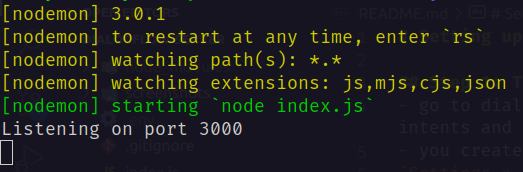

# Setting up the project

## Step 1: Training of Dialogflow Model
- go to [Dialogflow Website](https://dialogflow.cloud.google.com/) and create a Dialogflow agent. A default screen appears which already have default welcome intents and default fallback intents.
- you create your own model/use my model also. In order to use my model, follow:
`Settings » export and import » import from zip`  
[Model in zip format](https://drive.google.com/file/d/1HiorruUoeU7bif8R_2FHwu8XSxwKMXWa/view?usp=sharing)
Click on the intents tab to check the import.
- for a quick demo refer to right hand panel. 
- In settings, check whether Enabled beta features and API is enabled or not.

## Step 2: Installing Google Cloud CLI and setting it up
- Download the Google cloud CLI from the https://cloud.google.com/sdk/docs/install link
- Follow the instructions and install it.
- Run `gcloud init` and connect to the account using which dialogflow training was done.
- Follow the instructions that appear on the command line interface and select the appropriate project id of dialogflow agent.

## Step 3: Setting up and Running the server
- Navigate into the folder **chatbot**.
- First clone the git repo using the following command:  
`git clone https://github.com/Aditya16828/chatbot3d-backend.git`
- now enter the folder named **chatbot3d-backend** and run `npm i`
- create a `.env` file and inside it write `PROJECTID='<YOUR_PROJECT_ID>'`
- now run the command `npx nodemon index.js`
If the server successfully starts, then the following screen would appear:  

